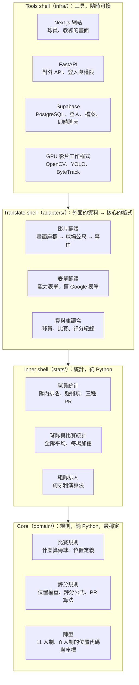
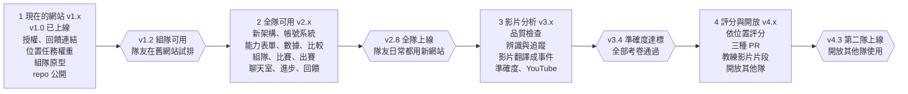

# Football Analysis Potato 產品規格

2026-10-01 · Evan 林宥成

> 線上版（可留言）：https://claude.ai/code/artifact/8c0ecbe6-deaa-4108-8447-6c725bb4233f

## 概述與範圍

Football Analysis Potato 把「球員卡網站」和「比賽影片分析」合成一個產品：每個人用自己的帳號登入，輸入 Team ID 加入一支或多支球隊，看到球員能力、比賽表現評分與 PR 值、組隊建議；教練另外可以上傳比賽影片、標記片段、在隊伍聊天室發戰術。

**使用者**

| 角色 | 怎麼進入 | 主要用途 |
| --- | --- | --- |
| 球員 | 自己的帳號登入 + 輸入 Team ID 加入球隊 | 填能力表、看自己和隊友的數據、比較、組隊、出賽登記 |
| 教練 | 同上，再輸入教練碼把自己在這一隊的身分升級成教練 | 球員能做的全部，加上上傳影片、標記片段、發筆記和戰術 |
| 系統管理者（Evan） | 管理後台 | 建立隊伍、發 Team ID 和教練碼、看意見回饋、處理問題 |

**這一版要做**

- 帳號系統：一個帳號可以加入多支球隊，每隊身分（球員 / 教練）分開
- 多隊伍、多賽季，每隊資料互相隔離
- 內建能力表單，取代 Google 表單
- 球員數據、球員比較、組隊（11 人制與 8 人制）
- 比賽列表（即將進行 / 已結束 / 已分析）、出賽登記
- 比賽影片上傳 → 自動分析 → 依位置的表現評分與三種 PR 值
- 教練影片片段、隊伍聊天室、賽季進步追蹤、意見回饋
- 背號選填，之後隨時補上或修改；影片裡追蹤到的球員先由教練手動對應是哪一位，不靠背號

**這一版不做**

- 即時（比賽進行中）分析：影片都是賽後上傳
- 原生手機 App：先做手機瀏覽器也好用的網站
- 付費與訂閱功能

## 帳號與權限

每個人用自己的帳號登入，用 Team ID 加入球隊；一個帳號可以加入多支球隊，在每一隊的身分分開計算。

**帳號**

- 用 Email 或 Google 帳號登入（Supabase 內建的登入功能），密碼不由我們自己保存。
- 登入後輸入 Team ID 加入球隊；畫面上方有「切換球隊」選單，例如系隊和社團队各一個。
- 同一個人在 A 隊是教練、在 B 隊是球員可以同時成立；權限依「目前選的球隊」決定。
- 因為每個人都有帳號，系統知道「我是誰」：球員只能改自己的能力表和出賽登記。

**Team ID 與賽季**

- 一支球隊可以有多個賽季（例如「2026 秋季」），每個賽季一個 Team ID。新賽季開始時發新的 ID，舊賽季資料保留但變成唯讀。
- Team ID 是系統產生的隨機字串（例如 `K7Q-4MZP-92XD`），不用 `csie2026` 這種猜得到的名字。
- 教練可以隨時重設 Team ID（例如無意間外流時），舊 ID 立刻不能再加入；已經加入的人不受影響。
- 教練可以把人移出球隊。同一個帳號跨賽季是同一個人，才能看進步趨勢。

**背號**

- 背號是選填欄位，還沒決定前顯示「—」，不影響任何功能。
- 教練可以在名單頁幫每位球員設定或修改背號；同一賽季、同一隊不能重複，換賽季可以換號碼。
- 系統一律用帳號辨識球員，不用背號，所以晚點補號碼或換號都不會影響歷史數據。
- 有背號的球員，球員卡、陣容圖、出賽名單都會顯示號碼。

**教練碼**

- 教練碼是「把自己在這一隊的身分升級成教練」的一次性代碼，用過就失效；之後靠帳號登入，不用再輸入。
- 由系統管理者或該隊現有教練產生；只存雜湊值（hash），資料庫裡看不到原文。
- 每位教練是自己的帳號，所以知道影片和訊息是誰發的，也能單獨取消教練身分。

**權限表**

| 功能 | 球員 | 教練 | 其他隊伍 |
| --- | --- | --- | --- |
| 填能力表 | 填自己的 | 看誰還沒填、提醒 | 不行 |
| 看本隊球員數據、比較、組隊 | 可以 | 可以 | 不行 |
| 分享陣容（連結、圖片） | 可以 | 可以 | 只看得到分享的那一張 |
| 比賽列表、出賽登記 | 看列表、登記自己 | 建立比賽、看全部 | 不行 |
| 聊天室 | 讀、回覆 | 發筆記和戰術、置頂 | 不行 |
| 上傳比賽影片、標記片段 | 不行 | 可以 | 不行 |
| 看影片和片段 | 可以 | 可以 | 不行 |
| 重設 Team ID、管理名單、設定背號、產生教練碼 | 不行 | 可以 | 不行 |
| 全體 PR、同位置 PR | 看百分比 | 看百分比 | 只貢獻匯總數據，看不到名字 |
| 意見回饋 | 送出、看自己的 | 送出、看自己的 | — |

## 功能規格

十項功能，F1–F3 是核心。每項的「完成標準」是驗收時逐條檢查的條件；「版本」是做出來的版本（見「版本規劃」）。

| # | 功能 | 優先 | 誰用 | 需要影片 | 版本 |
| --- | --- | --- | --- | --- | --- |
| F1 | 球員數據 | 必做 | 全部 | 不用（表現評分部分要） | v2.3 |
| F2 | 球員比較 | 必做 | 全部 | 不用 | v2.3 |
| F3 | 組隊（Team Building） | 必做 | 全部 | 不用 | v1.2 原型、v2.4 |
| F4 | 比賽列表、比賽數據與表現評分 | 必做 | 全部（教練上傳） | 列表不用，數據要 | v2.5、v3、v4.0 |
| F5 | 教練影片片段 | 必做 | 教練建立、全部觀看 | 要 | v4.2 |
| F6 | 隊伍聊天室 | 必做 | 教練發文、全部回覆 | 不用 | v2.6 |
| F7 | 出賽登記 | 建議 | 全部 | 不用 | v2.5 |
| F8 | 賽季進步追蹤 | 建議 | 全部 | 不用 | v2.7 |
| F9 | 內建能力表單 | 必做 | 球員填、教練看進度 | 不用 | v2.2 |
| F10 | 意見回饋 | 必做 | 全部送出、管理者處理 | 不用 | v1.1 表單版、v2.8 |

### F1 球員數據

- 能力雷達圖：自評能力加上比賽表現評分（F4），可切換「自評 / 表現 / 兩者疊圖」，可疊上全隊平均；圖例畫在圖的上方，不蓋到圖。
- 位置：球場圖標出自評擅長（藍）、自評不擅長（紅）、數據推薦（黃），以及各位置適合度 0–100。各類別顯示隊內排名；另有排行榜頁，可依平均、任一類別或 21 項能力中的任一項排名。
- 每項能力旁顯示三種 PR 值（見「球員表現評分與 PR 值」）。
- 完成標準：任何球員的頁面 2 秒內載入；沒有比賽資料的球員顯示「尚無比賽數據」，不顯示 0 分。

### F2 球員比較

- 兩位球員比較，或一位球員 vs 全隊平均 / 同位置平均。
- 雷達圖疊圖，列出差距最大的 5 項能力。
- 完成標準：可以比較不同賽季的同一位球員（例如去年 vs 今年）。

### F3 組隊（Team Building）

- 選賽制與陣型：
  - 11 人制：4-3-3、4-4-2、4-2-3-1、3-5-2、3-4-3、5-3-2
  - 8 人制（門將 + 7 名球員）：3-3-1、3-2-2、2-3-2、2-4-1
- 自動排人：每個位置排一人，且同一人不排兩次。分數 = 位置適合度 + 自評擅長加分 − 自評不擅長扣分，用「指派問題」的演算法（匈牙利演算法）求全隊總分最高的排法。
- 每個位置顯示「為什麼是他」（適合度、是否自評擅長），以及這個位置的所有人選；沒排進先發的出賽球員全部列為替補（不限人數），標出最適合替補的位置。人數不夠時門將一定先排。
- 可以拖曳替換、鎖定某人的位置後重新排；只從「出賽登記」說會到的人裡排（F7）。
- 分享：產生只能看、不能改的連結，以及一張球場陣容圖片（可貼 LINE / IG）。
- 完成標準：人數不足時清楚提示缺哪個位置；同樣輸入每次排出一樣的結果。

### F4 比賽列表、比賽數據與表現評分

- 比賽列表分三種狀態，系統自動切換：
  - **即將進行**：教練建立後、開賽時間之前；可以出賽登記、排陣容。
  - **已結束**：過了開賽時間或教練填了比分；可以上傳影片，分析中時顯示進度（排隊中 / 處理中 / 待教練確認）。
  - **已分析**：分析完成且教練確認過追蹤編號；可以看數據、評分、影片。
- 教練上傳比賽影片 → 系統排隊分析 → 教練確認「追蹤編號 = 哪位球員」→ 產生每人數據與評分。
- 每場比賽：跑動距離、熱區圖、傳球、控球率，以及依位置的表現評分。
- 完成標準：列表可以用狀態篩選；影片不合格時說明原因，比賽停在「已結束」。

### F5 教練影片片段

- 教練在比賽影片上標出 5–60 秒的片段，標記相關球員、加上說明。
- 片段不另外剪檔：只存「哪支 YouTube 影片、開始秒數、結束秒數」，播放時讓 YouTube 從那段開始播、播到那段停。
- 片段可以貼到聊天室；球員在自己頁面看得到「教練標記我的片段」。
- 完成標準：片段只有本隊看得到；手機上可以直接播放。

### F6 隊伍聊天室

- 教練發筆記、戰術（可附陣容、影片片段），可置頂；球員可回覆。
- 完成標準：新訊息不用重新整理就出現；教練可刪除任何訊息。

### F7 出賽登記

- 教練建立比賽（對手、時間、球衣顏色、熱身時間、賽制），比賽從「即將進行」開始；球員點「出席 / 請假」，取代在群組裡複製接龍訊息。
- 出席名單直接給組隊（F3）使用。

### F8 賽季進步追蹤

- 每賽季重填一次能力表（F9），連同每場表現評分，畫出各能力的變化趨勢。
- 影片分析還沒上線前，只看自評的變化。

### F9 內建能力表單

- 球員加入球隊後，第一次進來就請他填：21 項能力 1–5 分、自評擅長和不擅長的位置、給球隊的話；題目和現在的 Google 表單一樣，寫在設定檔。
- 每個賽季一份。賽季中可以修改，賽季封存後鎖定。
- 教練看得到誰還沒填，可以一鍵在聊天室提醒。
- 直接連到帳號，不用名字對資料，也不會重複填寫。現有 Google 表單的回覆在 v2.0 匯入成第一個賽季。
- 完成標準：手機上 3 分鐘內填完；沒填完離開時保留已填的部分。

### F10 意見回饋

- 每一頁右下角一個回饋按鈕：選類型（Bug / 建議 / 其他）、寫內容、可附截圖。
- 系統自動附上是誰、哪一頁、哪個版本、什麼裝置。
- 有新回饋時發到管理者的私人 Discord 頻道（Webhook）。
- 「回饋管理」頁面只有管理者看得到，每則有狀態（新的 → 處理中 → 已解決），回覆會通知填寫的人。
- 不自動開 GitHub Issue：repo 公開後 Issue 人人看得到；管理者確認是 Bug 後再自己整理成 Issue。
- v1.1 先用 Google 表單版：側邊欄放連結，回覆進試算表，用 Google 表單的 Email 通知。
- 完成標準：送出後 1 分鐘內 Discord 收到通知；Webhook 網址只放在伺服器設定。

## 球員表現評分與 PR 值

每場比賽依影片數據給每位球員各維度 0–100 分，再依他踢的位置的主要任務加權成總分；因為業餘球員的原始分數可能普遍偏低，每個分數旁都同時顯示三種 PR 值。

**評分維度（第一版，之後可以再加）**

| 維度 | 從影片算什麼 | 可信度 |
| --- | --- | --- |
| 準確度 | 傳球成功率（接球隊友控住球才算成功，見「事件定義」）、射正率 | 高（只要看得到球） |
| 冒險程度 | 向前傳球佔比、穿透後衛線的傳球、帶球突破嘗試次數 | 中 |
| 聰明度 | 傳到空檔（接球者身邊 5 公尺內沒有對手）、創造射門機會的傳球 | 中低（只是替代指標） |
| 工作量 | 跑動距離、衝刺次數（每 90 分鐘） | 高 |
| 防守貢獻 | 攔截、搶回球權的次數 | 中 |
| 參與度 | 觸球次數、接應次數 | 高 |
| 守門 | 撲救率、出擊成功次數（只用於門將） | 中 |

- 每種數據先換算成「每 90 分鐘」，上場時間短的球員才不會吃虧。上場不到 20 分鐘的場次不計分。
- 聰明度只靠位置資料推算，看不到球員的觀察與判斷，網站上要標註「推算」。
- 評分公式寫在 Core 層，設定檔可調權重；公式改了就重算所有歷史分數，並記錄公式版本。

**依位置的主要任務與權重（初版）**

同樣是 60 分的防守貢獻，對中後衛很重要、對前鋒影響不大；總分 = 各維度分數 × 該位置的權重。權重寫在 `config/performance.toml`，每列加總 100%。

| 位置 | 主要任務 | 準確度 | 冒險 | 聰明 | 工作量 | 防守 | 參與 | 守門 |
| --- | --- | --- | --- | --- | --- | --- | --- | --- |
| GK 門將 | 撲救、出擊、腳下出球 | 20% | 0% | 0% | 0% | 0% | 10% | 70% |
| CB 中後衛 | 攔截、對抗、安全出球 | 25% | 5% | 5% | 10% | 45% | 10% | 0% |
| LB / RB 邊後衛 | 防守、套邊、傳中 | 20% | 10% | 10% | 20% | 25% | 15% | 0% |
| LWB / RWB 翼衛 | 整條邊路來回、傳中、回防 | 20% | 15% | 10% | 25% | 15% | 15% | 0% |
| CDM 防守中場 | 攔截、保護後衛、穩定分球 | 25% | 5% | 10% | 15% | 30% | 15% | 0% |
| CM 中場 | 推進、串聯前後場 | 25% | 15% | 15% | 15% | 10% | 20% | 0% |
| CAM 攻擊中場 | 關鍵傳球、創造機會 | 20% | 20% | 30% | 10% | 5% | 15% | 0% |
| LM / RM 邊中場 | 邊路推進、傳中、回防 | 20% | 20% | 15% | 20% | 10% | 15% | 0% |
| LW / RW 邊鋒 | 突破、傳中、射門 | 20% | 30% | 20% | 15% | 5% | 10% | 0% |
| ST 前鋒 | 射門、門前搶點、做球 | 35% | 20% | 20% | 10% | 5% | 10% | 0% |

- 準確度也依位置看不同動作：前鋒以射正率為主，後衛和中場以傳球成功率為主。
- 一場踢了兩個位置，依各位置的上場分鐘分開計算。
- 百分比是初版猜測，第一批本隊比賽分析完後，和教練的觀察對照再調。

**三種 PR 值**

| PR 類型 | 比較對象 | 例子 |
| --- | --- | --- |
| 隊內 PR | 同隊、同賽季的隊友 | 傳球準確度贏過 80% 的隊友 |
| 全體 PR | 所有隊伍的所有球員 | 贏過系統內 65% 的球員 |
| 同位置 PR | 所有隊伍中踢同一個位置的球員 | 在所有 CB 中贏過 72% |

例子的百分比是示意數字。PR 的算法（同分算一半）：

```latex
PR = \frac{\#\{\text{分數} < x\} + 0.5 \times \#\{\text{分數} = x\}}{N} \times 100
```

- **樣本太少**：比較對象少於 10 人（隊內少於 5 人）時顯示「樣本不足」，不顯示數字。
- **跨隊隱私**：全體與同位置 PR 只顯示百分比，其他隊伍看不到名字和分數。
- **評分資料庫**：一張評分紀錄表（球員、隊伍、賽季、比賽、位置、上場分鐘、各維度分數、公式版本）就能算出三種 PR；賽季分數 = 各場分數依上場分鐘加權平均。

## 系統架構

系統照 Clean Architecture 分四層，資料夾就是層；足球規則與評分公式在最內層，換資料庫、網站或辨識模型都不動到它們。



> 箭頭是依賴方向：外層可以用內層，內層不知道外層存在（`tests/test_architecture.py` 自動檢查）。

每一層只用得到比它更內層的東西：例如「球員統計」用「評分規則」算分數，但不知道資料來自 PostgreSQL 還是影片。

**一場比賽影片怎麼變成數據**

1. 教練在「已結束」的比賽上傳原始影片 → 存進 Supabase Storage，FastAPI 建立一個分析工作。
2. GPU 工作程式接到工作：品質檢查 → OpenCV 拆畫面 → YOLO 辨識 → ByteTrack 追蹤。
3. 影片翻譯把座標換成球場公尺、判斷傳球射門事件，寫進 events。
4. 教練確認「追蹤編號 = 哪位球員」。
5. 統計層套用 Core 的規則，算出 match\_stats、依位置的 performance\_ratings 與 PR；比賽變成「已分析」。
6. 原始影片用教練授權的 YouTube 帳號上傳到他的頻道，網站嵌入播放；Supabase 裡的原檔 30 天後刪除，只留數據、事件和片段的時間範圍。

YouTube 條款不允許把影片抓下來處理，所以分析一定用原始影片、在上傳 YouTube 之前做；YouTube 只負責播放。

## 技術選型

建議把 SQLite + Streamlit 換成 PostgreSQL（用 Supabase 代管）+ FastAPI 後端 + Next.js 前端，影片分析丟給獨立的 GPU 工作程式；現有的 `domain/`（Core）和 `stats/`（Inner shell）原封不動沿用。

**為什麼要換**

- SQLite 是一個檔案，同時只能有一個程式寫入，很多隊同時用會卡住；部署到雲端時檔案也可能在重新部署後消失。
- Streamlit 每次操作都把整頁程式重跑一次，適合資料展示和 Demo，但不擅長聊天室、拖曳排陣容這類互動，也不是為大量同時上線的使用者設計。

**建議組合**

| 層 | 選擇 | 理由 | 代價 |
| --- | --- | --- | --- |
| 資料庫 | PostgreSQL（Supabase 代管） | 關聯式資料庫，算 PR 這種跨隊統計查詢最方便；內建「列層級安全」（Row Level Security）可以從資料庫層擋住跨隊讀取 | 要學 SQL 與權限設定 |
| 登入 | Supabase Auth | Email 或 Google 帳號登入，密碼不經過我們的程式；登入身分直接用在資料庫權限規則 | 綁定在 Supabase |
| 檔案儲存 | Supabase Storage | 原始影片（暫存到分析完）、陣容圖片和資料庫用同一套權限 | 影片很大，免費方案放不下（見下方） |
| 影片播放 | YouTube（教練自己的頻道） | 免費儲存和播放、手機上播放順；片段用開始 / 結束秒數就好 | API 審核前只能私人（見下方） |
| 即時聊天 | Supabase Realtime | 新訊息自動推到畫面，不用自己架伺服器 | 綁定在 Supabase |
| 通知 | Discord Webhook | 意見回饋發到管理者的私人頻道，不用寫機器人 | Webhook 網址等於密碼，要放在伺服器設定 |
| 後端 API | FastAPI（Python） | 和影片分析同一種語言，`domain/`、`stats/` 直接 import；自動產生 API 文件 | 多一個要部署的服務 |
| 前端 | Next.js（React + TypeScript） | 拖曳排陣容、聊天室、手機版面都能做細；分享連結可產生預覽圖 | 要學 JavaScript / TypeScript |
| 影片分析 | 工作佇列 + GPU 工作程式（開發期用 Google Colab） | 一場比賽要跑很久，不能讓網站等；上傳後排隊，跑完寫回資料庫 | GPU 按時數付費 |
| 辨識與追蹤 | Ultralytics YOLO + ByteTrack / BoT-SORT | 現成模型，追蹤器一個參數就能換 | 授權是 AGPL-3.0（見下方） |

**Supabase 方案限制**（[官方價格頁](https://supabase.com/pricing)）

| 方案 | 資料庫 | 檔案儲存 | 單檔上傳上限 | 備註 |
| --- | --- | --- | --- | --- |
| Free | 500 MB | 1 GB | 50 MB | 一週沒人用會暫停 |
| Pro（每月 25 美元起） | 8 GB | 100 GB | 500 GB | 不會暫停 |

一場 90 分鐘 1080p 影片通常有好幾 GB，所以開發期用 Free（不存整場影片，分析完只留數據和片段），正式給多隊使用時再升 Pro。

**YouTube 上傳限制**（[YouTube Data API 官方文件](https://developers.google.com/youtube/v3/docs/videos/insert)）

- 用 YouTube Data API 上傳，每次只算 1 單位上傳額度，單檔上限 256 GB；教練先用自己的 Google 帳號授權一次。
- 2020 年 7 月 28 日之後建立、還沒通過 Google 審核的 API 專案，上傳的影片一律是**私人**。私人影片只有被邀請的 Google 帳號看得到，教練要在 YouTube Studio 邀請隊友。
- 通過審核後改成**不公開**（有連結才看得到），網站嵌入就能直接播；審核放在 v5 之後。

**授權**：Ultralytics YOLO 是 [AGPL-3.0](https://github.com/ultralytics/ultralytics)，用在網路服務上就要公開原始碼。已決定把 repo 設成公開，專案本身也採用 AGPL-3.0；金鑰、球員資料一律不進 Git。

**沒選的替代方案**

- Firebase：文件式資料庫，跨隊統計和排名查詢不如 SQL 方便。
- Django：功能完整但較重，這個專案主要是 API，FastAPI 更輕。
- 繼續用 Streamlit：可留給內部分析工具和課堂 Demo，不當正式網站。

## 資料模型

所有資料都掛在「賽季」底下，賽季屬於一支球隊；資料庫的權限規則依「賽季」隔離各隊。

| 資料表 | 一筆代表 | 主要欄位 | 屬於 |
| --- | --- | --- | --- |
| users | 一個帳號（Supabase Auth 管理） | Email、姓名、暱稱、是否系統管理者 | — |
| teams | 一支球隊 | 名稱、建立時間 | — |
| seasons | 一個賽季 | 名稱、Team ID（隨機字串）、是否封存 | teams |
| memberships | 一個帳號在某賽季的身分 | 身分（球員 / 教練）、背號（選填，可之後補）、自評擅長 / 不擅長位置、給球隊的話 | seasons + users |
| coach\_codes | 一組教練碼 | 雜湊值、產生者、是否已使用 | seasons |
| self\_ratings | 一份能力表（每人每賽季一份） | 21 項能力分數、最後修改時間 | memberships |
| matches | 一場比賽 | 日期、對手、比分、賽制（11 / 8 人）、狀態（即將進行 / 已結束 / 已分析） | seasons |
| attendance | 球員對一場比賽的回覆 | 出席 / 請假 | matches + memberships |
| videos | 一支上傳的影片 | 原檔位置、YouTube 影片 ID、品質檢查結果、分析進度 | matches |
| tracks | 影片裡的一個追蹤編號 | 對應的球員（教練確認） | videos |
| events | 一個足球事件 | 時間、類型（傳球、射門…）、球員、球場座標、成功與否 | matches |
| match\_stats | 球員一場的一項數據 | 數據名稱、數值 | matches + memberships |
| performance\_ratings | 球員一場在一個位置的表現評分 | 位置、上場分鐘、各維度分數、總分、公式版本 | matches + memberships |
| lineups | 一組陣容 | 賽制、陣型、每個位置的球員、分享連結 | seasons |
| clips | 一個教練影片片段 | 開始 / 結束秒數、標記的球員、說明 | videos |
| messages | 聊天室一則訊息 | 內容、附件（陣容 / 片段）、是否置頂、發文者 | seasons |
| feedback | 一則意見回饋 | 類型、內容、截圖、頁面、版本、裝置、狀態、管理者回覆 | users |

- 三種 PR 都從 performance\_ratings 查出來：隊內 = 同賽季；全體 = 全部；同位置 = 同位置欄位。
- 一個帳號加入幾支球隊，就有幾筆 memberships；權限規則都以「你在這個賽季有沒有 membership、是什麼身分」來判斷。
- feedback 只有填的人和系統管理者看得到。
- 現在的 Google 表單回覆匯入成 self\_ratings；`matches`、`match_stats` 可以直接搬過來，只是多掛上賽季。

## 影片分析技術標準

影片要先通過品質檢查才分析，分析結果要在「有標準答案的公開資料」和「自己人工標記的比賽」上達到下表門檻，才算可以上線。

### 輸入規格

| 項目 | 要求 | 不符合時 |
| --- | --- | --- |
| 解析度 | 至少 1920×1080 | 拒絕 |
| 幀率 | 25–60 fps | 低於 25 拒絕 |
| 鏡頭 | 腳架固定、高處拍攝、不縮放 | 標記「可信度低」 |
| 場地 | 至少看得到 4 個場地線交叉點（校正用） | 請教練手動點選場地角落 |
| 格式 | MP4（H.264）或 MKV | 自動轉檔 |
| 長度 | 單檔 ≤ 120 分鐘 | 請分段上傳 |

### 品質檢查（分析前自動跑）

- 檢查模糊度、亮度、鏡頭晃動量、場地線是否偵測得到。
- 結果分三級：合格 / 可分析但可信度低 / 拒絕，並告訴教練原因。可信度低的場次不計入 PR。

### 事件定義

事件怎麼算寫在 Core 層的比賽規則，影片分析和人工標記用同一套定義，準確度才比得了。

| 事件 | 定義 | 可調參數 |
| --- | --- | --- |
| 成功傳球 | 球離開傳球者後，接球隊友能把球控住：持球至少 1 秒，或者下一個動作（傳、射、帶）是他做的 | 持球秒數（預設 1 秒） |
| 失敗傳球 | 球被對手碰到、出界，或隊友碰到但沒有控住（不到 1 秒就丟球） | 同上 |
| 射門 / 射正 | 球朝球門方向飛出；進球或被門將擋下算射正 | 射門角度範圍 |
| 搶回球權 | 對手持球時，球轉到自己隊且最後碰球的是這位球員 | — |

接球者「碰到球」不等於「控住球」：一種很難接的傳球就算失敗，這樣準確度才反映傳球品質。

### 準確度指標與門檻

下表是初版目標，第一次驗證後依實際結果調整。

| 指標 | 怎麼量 | 初版門檻 |
| --- | --- | --- |
| 球員偵測率 | 標記的球員有幾 % 被框到 | ≥ 90% |
| 球偵測率 | 球在畫面內時有幾 % 被框到 | ≥ 70% |
| 追蹤編號切換 | 每 10 分鐘同一人編號跳掛幾次 | ≤ 5 次 |
| 追蹤整體分數 | HOTA（SoccerNet 追蹤挑戰的標準指標） | 記錄基準，每版不得下降 |
| 跑動距離 | 和標準答案的誤差 | ≤ 10% |
| 傳球次數 | 和人工計數的誤差 | ≤ 15% |
| 處理時間 | 一場 90 分鐘比賽 | ≤ 2 小時 |

### 驗證資料與方法

- **訓練與驗證分開**：微調 YOLO 用的影片，絕不拿來打分數；另留一組模型沒看過的影片當「考卷」。
- **[SoccerNet](https://www.soccer-net.org/data)**：500 多場轉播影片，附追蹤、球員重新辨識、鏡頭校正、動作標記等標準答案。影片要在 Hugging Face 申請並同意保密協議（NDA）才能下載，只能用在研究，不能公開散布。用來訓練偵測與驗證追蹤。
- **[StatsBomb Open Data](https://github.com/statsbomb/open-data)**：免費的比賽事件資料（傳球、射門…），但**不含影片**。可以用來決定事件的定義（什麼算一次成功傳球）和校正評分公式；發表分析時要標註來源。
- **自己的比賽**：拍一場本隊比賽，人工標記其中 10 分鐘（每人位置、傳球事件）。這是最重要的一份考卷：轉播畫面和業餘固定鏡頭差很多，在轉播影片上準，不代表在我們的影片上準。
- **每次改模型或分析程式**，都重跑全部考卷；任何一項低於門檻就不上線。

## 非功能需求

| 類別 | 要求 |
| --- | --- |
| 效能 | 一般頁面 2 秒內載入；組隊自動排人 1 秒內完成；聊天訊息 2 秒內出現在其他人畫面 |
| 規模 | 第一階段支援 50 支球隊、各 30 人同時使用；之後靠升級方案擴充，不改程式 |
| 資料隔離 | 各隊資料由資料庫的權限規則隔離；「A 隊拿不到 B 隊資料」和「同一個帳號在兩隊身分不同」都要有自動測試 |
| 安全 | 登入交給 Supabase Auth；Team ID 隨機且可重設；教練碼只存雜湊值、用過即失效；登入和加入嘗試太多次就暫時鎖住；金鑰和 Webhook 網址只放在伺服器設定，不進 Git |
| 隱私 | 拍攝前取得球員同意；能力表說明資料用途與誰看得到；球員可要求刪除自己的資料；跨隊只共享匯總數據；公開的 repo 裡不出現任何球員資料 |
| 影片儲存 | 原始影片分析完保留 30 天後刪除（可依教練需求調整）；播放用 YouTube，片段只存時間範圍 |
| 意見回饋 | 送出後 1 分鐘內 Discord 收到通知 |
| 手機 | 所有功能在 375 px 寬的手機瀏覽器可用 |
| 測試 | Core 與 Inner shell 用假資料測試、不需要影片；架構測試確保內層不 import 外層；影片分析每版跑完「影片分析技術標準」的考卷 |

## 版本規劃

開發分四個階段、一版一版做，每一版都能 Demo、能單獨上線；跟影片無關的功能全部在 v2.8 前做完，就算影片分析來不及，全隊也有完整可用的網站。



版本號：第一個數字是階段，第二個是一個能 Demo 的功能，第三個留給修 bug（例如 v2.1.1）。大小：S 約幾天、M 約 1–2 週、L 約 3 週以上；日期等課程截止日確定後再填。每版完成後在 Git 打標籤（例如 `git tag v1.1`）。

### 階段 1：現在的網站（Streamlit）

| 版本 | 內容 | 完成條件 | 大小 |
| --- | --- | --- | --- |
| v1.0 | 球員卡、雷達圖、位置圖、球員比較 | 已上線 | — |
| v1.1 | AGPL-3.0 授權、隱藏隊友名字、側邊欄回饋表單連結、repo 公開 | GitHub 上看不到任何個資，測試全過 | S |
| v1.2 | 雷達圖圖例改畫在圖上方、各類別隊內排名、排行榜頁（平均、類別、21 項能力）、組隊頁（自動排人、鎖定位置、其他出賽球員全部列為替補、每個位置列出所有人選）；Core：11 人制和 8 人制陣型、位置任務權重表 | 手機上圖例不蓋到圖；排行榜點名字能開球員報告；隊友在現在的網站就能用組隊 | M |

### 階段 2：全隊可用的基本功能（不需要影片）

| 版本 | 內容 | 完成條件 | 大小 |
| --- | --- | --- | --- |
| v2.0 | Supabase 資料庫和權限規則、FastAPI 後端、匯入 Google 表單舊資料 | 自動測試證明 A 隊讀不到 B 隊 | L |
| v2.1 | 帳號系統：登入、用 Team ID 加入、一個帳號加入多隊、教練碼升級身分 | 同一個帳號在兩隊身分不同 | M |
| v2.2 | Next.js 網站第一版、內建能力表單（F9） | 手機 3 分鐘內填完 | M |
| v2.3 | 球員數據（F1）、球員比較（F2） | 功能和 v1.0 一樣，手機順暢 | M |
| v2.4 | 組隊（F3）：拖曳、鎖定、分享連結和陣容圖片 | 分享的陣容只能看 | M |
| v2.5 | 比賽列表（即將進行、已結束）、出賽登記（F7） | 出席名單直接帶進組隊 | M |
| v2.6 | 隊伍聊天室（F6） | 新訊息 2 秒內出現 | M |
| v2.7 | 賽季進步追蹤（F8） | 跨賽季同一人資料連得起來 | S |
| v2.8 | 意見回饋（F10，Discord 通知）、本隊試用、Google 表單和舊網站退役 | 關卡：隊友日常都用新網站 | S |

### 階段 3：影片分析

| 版本 | 內容 | 完成條件 | 大小 |
| --- | --- | --- | --- |
| v3.0 | 影片上傳、品質檢查、分析工作排隊 | 比賽顯示「已結束 · 分析中」和進度 | M |
| v3.1 | YOLO 辨識、ByteTrack 追蹤、教練確認球員編號 | 球員偵測率 ≥ 90%，每 10 分鐘編號跳掉 ≤ 5 次 | L |
| v3.2 | 場地 4 點校正、座標換公尺、跑動距離、熱區圖 | 跑動距離誤差 ≤ 10% | M |
| v3.3 | 事件偵測：傳球（接球者控住才算成功）、射門、搶回球權 | 傳球次數誤差 ≤ 15% | L |
| v3.4 | 準確度考卷和自動報表；比賽可以變成「已分析」 | 關卡：全部考卷達門檻 | M |
| v3.5 | 上傳到教練的 YouTube 頻道、網站嵌入播放、原檔 30 天刪除 | 隊友在網站上看得到影片 | S |

### 階段 4：評分與開放

| 版本 | 內容 | 完成條件 | 大小 |
| --- | --- | --- | --- |
| v4.0 | 依位置主要任務計算表現評分，公式有版本號 | 改公式後歷史分數會重算 | M |
| v4.1 | 三種 PR 值、樣本不足提示 | 跨隊只看得到百分比 | M |
| v4.2 | 教練影片片段（F5） | 球員頁面看得到「教練標記我的片段」 | S |
| v4.3 | 開放其他隊、壓力測試（50 隊、每隊 30 人） | 關卡：第二支球隊正式使用 | M |

之後（v5 以後）：送審 YouTube API 讓影片改成不公開、比賽中的即時分析、手機 App。

## 風險與待決定事項

| 風險 | 影響 | 備案 |
| --- | --- | --- |
| 業餘影片畫質差 | 辨識不準、評分失真 | 品質檢查擋下不合格影片；提供拍攝教學給教練 |
| 追蹤跟錯人 | 數據算到別人頭上 | 每幾秒用球衣顏色與位置重新比對；不確定的片段標記給教練確認 |
| 轉播影片訓練的模型在業餘影片不準 | 驗證分數好看但實際不準 | 以自己標記的比賽為主要考卷；標記幾場本隊影片再微調 |
| 「聰明度」很難從影片判斷 | 分數沒有說服力 | 標註為推算指標；先做準確度、工作量等可信度高的維度 |
| 位置權重是猜的 | 某些位置分數偏高或偏低 | 第一批比賽後和教練的觀察對照再調；公式有版本號可以重算 |
| YouTube API 審核前只能私人 | 教練要一個一個邀請隊友 | 審核前先邀請；也可以讓教練在 YouTube Studio 自己改成不公開後貼連結 |
| 影片儲存與 GPU 費用 | 使用者變多後每月要付費 | 原檔分析完 30 天刪除、播放交給 YouTube；先用免費方案與 Colab |
| 課程時間不夠 | 功能做一半 | 照版本順序做，每版都能 Demo；做到 v2.8 全隊就有完整可用的網站 |
| 學新技術（SQL、TypeScript） | 進度變慢 | 先做後端與資料庫；v1.2 的 Core 和統計程式搬到新架構直接沿用 |

**待決定**

- [x] 球員要不要加 4 位數 PIN？→ 不用，改成每個人用自己的帳號登入
- [x] 成功傳球的定義 → 接球者要控住球（見「事件定義」）
- [x] 評分權重是否依位置不同 → 是，依位置的主要任務
- [x] repo 公開還是私人 → 公開，採用 AGPL-3.0
- [ ] 「控住球」的持球秒數用 1 秒可以嗎？
- [ ] 整場原始影片保留幾天？（暫定 30 天）
- [ ] 教練要不要在 v2.5 手動輸入每場的進球、助攻、出場分鐘？
- [ ] 各版本的日期（等課程截止日）
